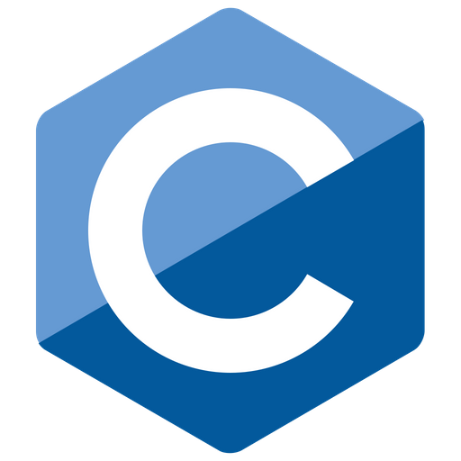
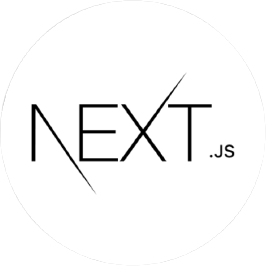
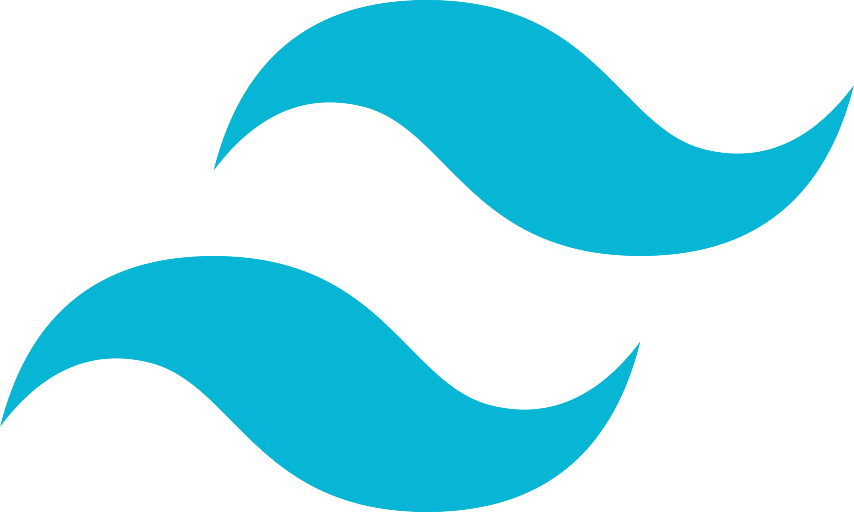
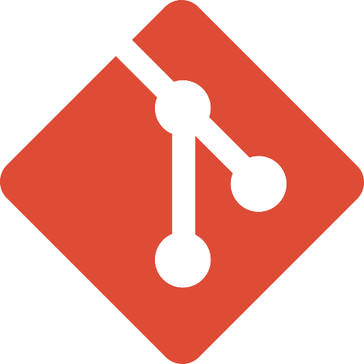
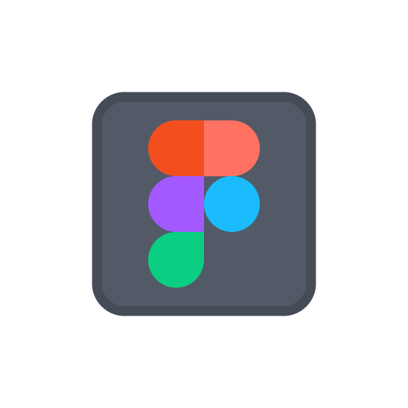

<h1>Hi there, I'm <a href="https://developer-pranav.github.io" target="_blank">Pranav</a> 👨‍💻</h1> 

A Fullstack Passionate Developer from India 🇮🇳

 ## My Skills 

 **Languages**
 
 |||||
 |--|--|--|--|--|--|

  **Frontend**
 
 |||
 |--|--|--|--|

  **Backend**
 
 |||
 |--|--|--|--|
 
 **Frameworks**
 
 ||
 |--|--|--|
 
 **Tools**
 
 |||||
 |--|--|--|--|--|--|
 

 **Connect with Me**
---
     

